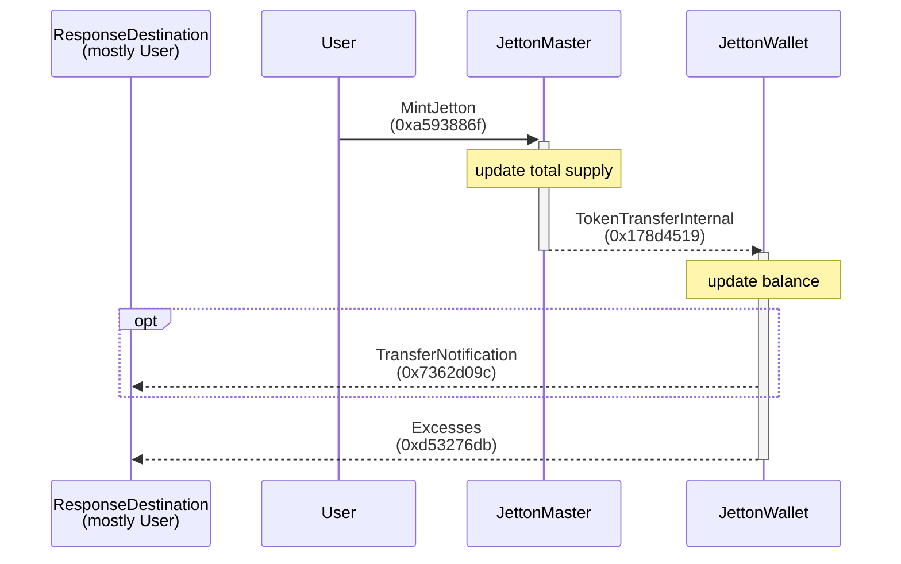
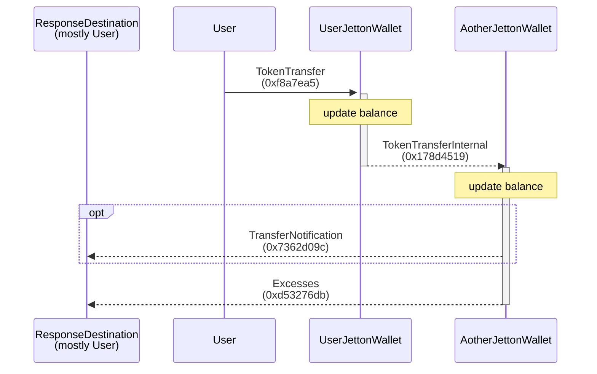
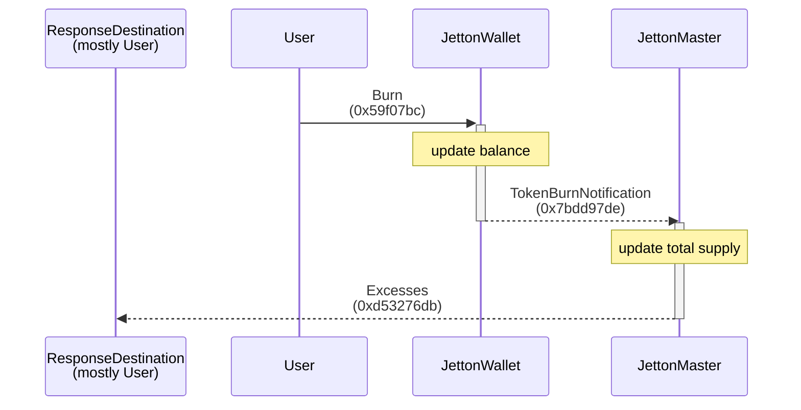

# Jetton

- [Jetton](#jetton)
  - [Scripts](#scripts)
  - [Flows](#flows)
    - [Mint](#mint)
    - [Transfer](#transfer)
    - [Burn](#burn)

## Scripts

-   [../scripts/jetton.ts](https://github.com/Laisky/tact-utils/blob/main/scripts/jetton.ts)
-   [../tests/Jetton.spec.ts](https://github.com/Laisky/tact-utils/blob/main/tests/Jetton.spec.ts)

## Flows

### Mint

> 
>
> <https://testnet.tonviewer.com/transaction/d73c4a2df090d881a69d76f3e13bcebb759c8a29d8e1b5aff3b6d6b89faf2f6e>

### Transfer

> 
>
> <https://testnet.tonviewer.com/transaction/08915faa3d2e7f5739a93211f3d82206d568acefbd7e2a186bee68c011d22da0>

### Burn

> 
>
> <https://testnet.tonviewer.com/transaction/57b516141e535a23fb14bfa6441a37b5cd5c680c307394ce5e034bc27f5fea63>

