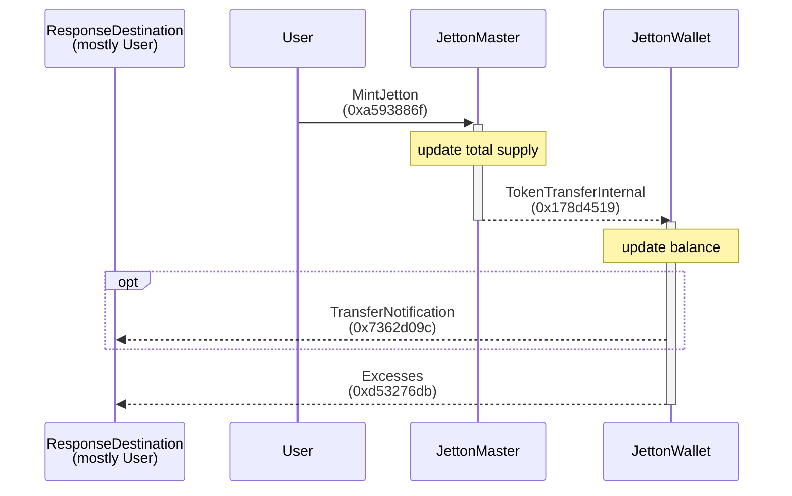
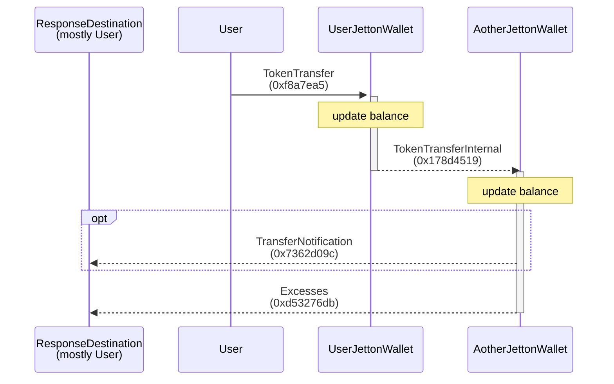
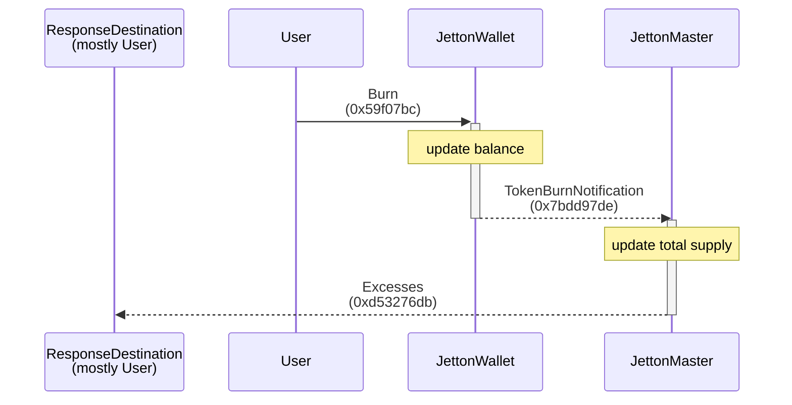

# Jetton

-   [TEP-74 Fungible tokens (Jettons) standard](https://github.com/ton-blockchain/TEPs/blob/master/text/0074-jettons-standard.md#jetton-master-contract)

## Flows

### Mint

### Transfer

### Burn

