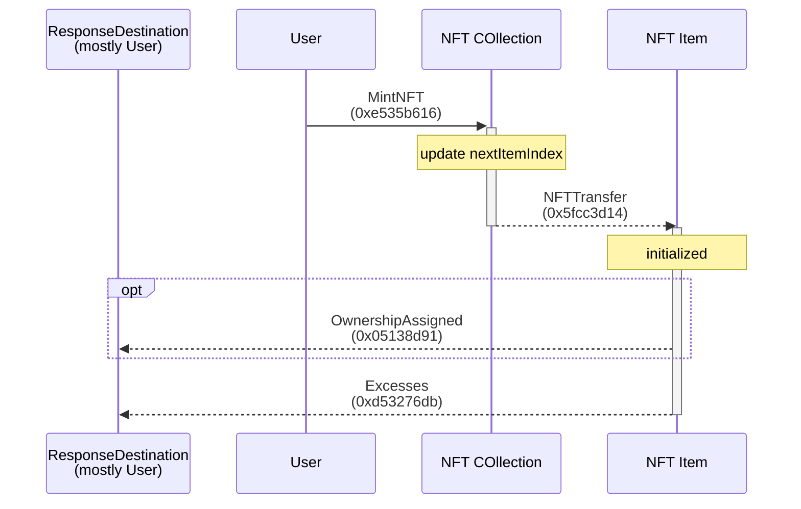
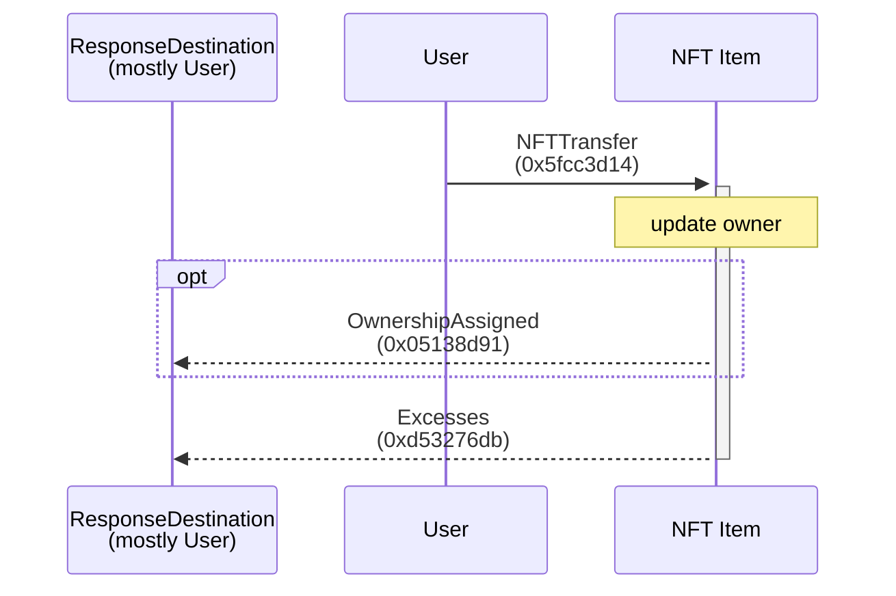
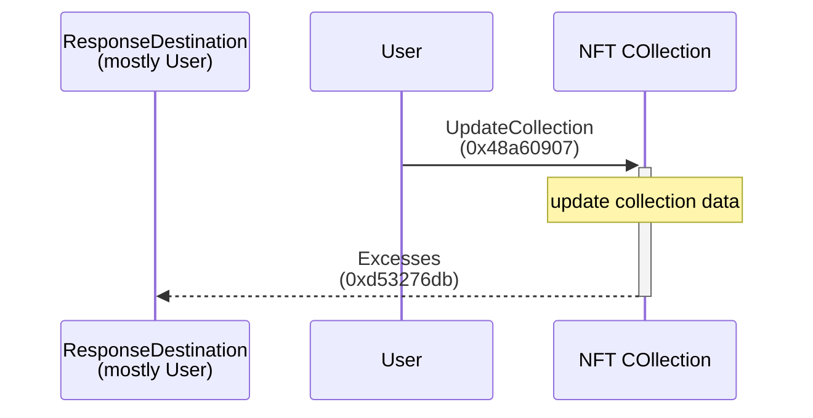

# NFT

- [NFT](#nft)
  - [Scripts](#scripts)
  - [Flows](#flows)
    - [Mint](#mint)
    - [Transfer](#transfer)
    - [Update Collection Data](#update-collection-data)

[📖 TEP-062 NFT Standard](https://github.com/ton-blockchain/TEPs/blob/master/text/0062-nft-standard.md)

## Scripts

-   [../scripts/nft.ts](https://github.com/Laisky/tact-utils/blob/main/scripts/nft.ts)
-   [../tests/NFT.spec.ts](https://github.com/Laisky/tact-utils/blob/main/tests/NFT.spec.ts)

## Flows

### Mint

### Transfer

### Update Collection Data

