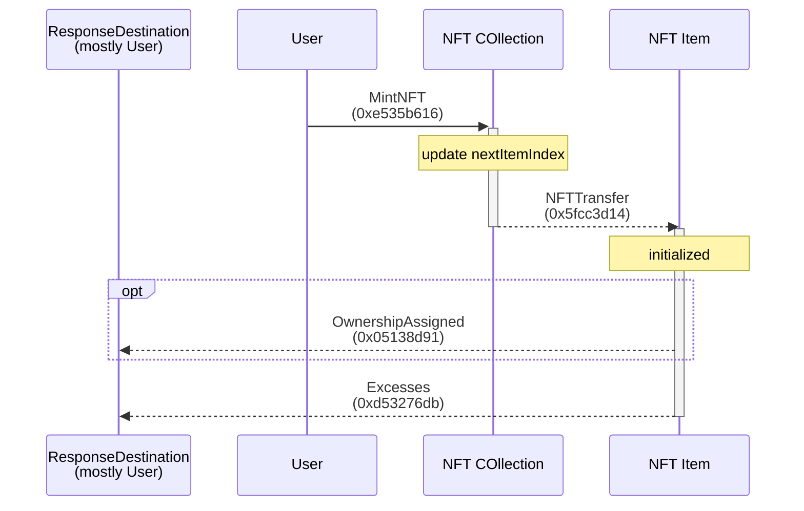
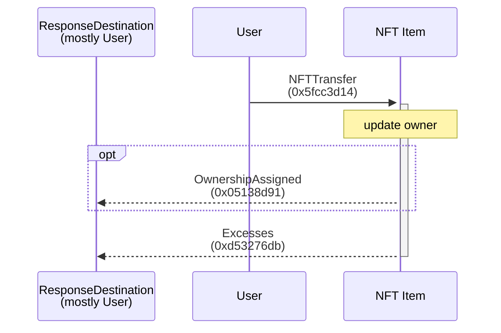
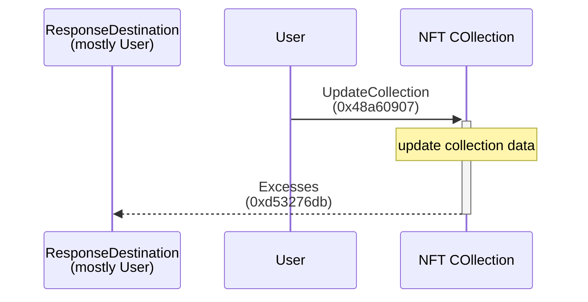

# NFT

- [NFT](#nft)
  - [Scripts](#scripts)
  - [Flows](#flows)
    - [Mint](#mint)
    - [Transfer](#transfer)
    - [Update Collection Data](#update-collection-data)

[📖 TEP-062 NFT Standard](https://github.com/ton-blockchain/TEPs/blob/master/text/0062-nft-standard.md)

## Scripts

-   [../scripts/nft.ts](https://github.com/Laisky/tact-utils/blob/main/scripts/nft.ts)
-   [../tests/NFT.spec.ts](https://github.com/Laisky/tact-utils/blob/main/tests/Nft.spec.ts)

## Flows

### Mint

> 
>
> <https://testnet.tonviewer.com/transaction/ddf0a703fec38e0508fc72c7d74642e42167f6c6e60ed184018645e090cc2ef2>

### Transfer

> 
>
> <https://testnet.tonviewer.com/transaction/0d1cb9f5f0e30764881e0cf5bdfabdf4ce452ed55dea998729791dbc53eb654a>

### Update Collection Data

> 
>
> <https://testnet.tonviewer.com/transaction/dfc15c101b66e99f5bf81c2ef5a21fc553fc8610258b678d92a129d8532476f2>

