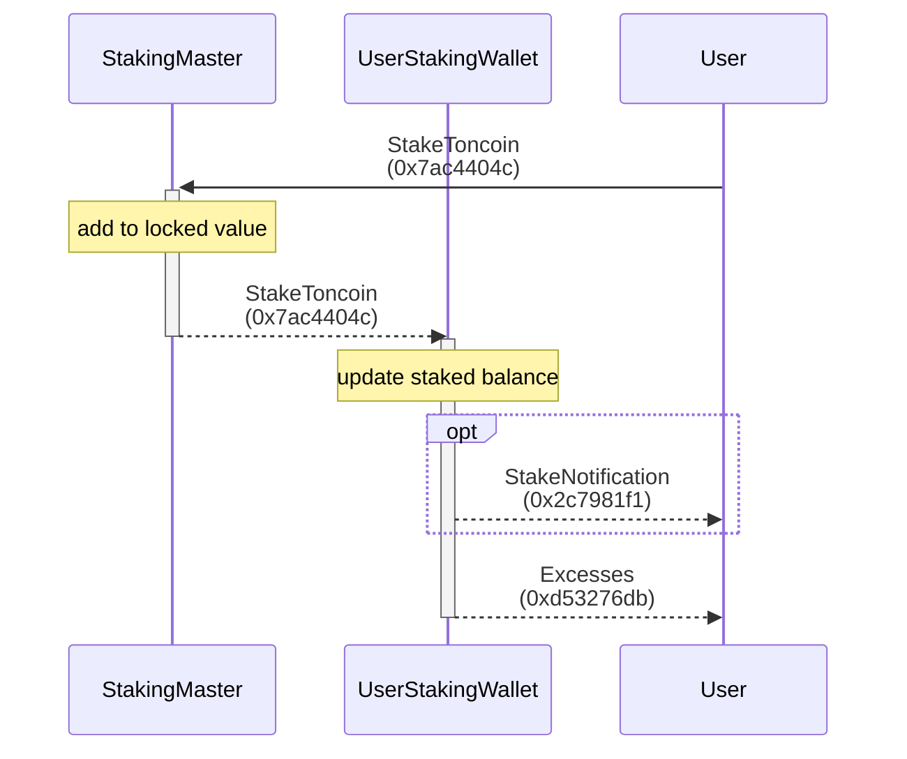
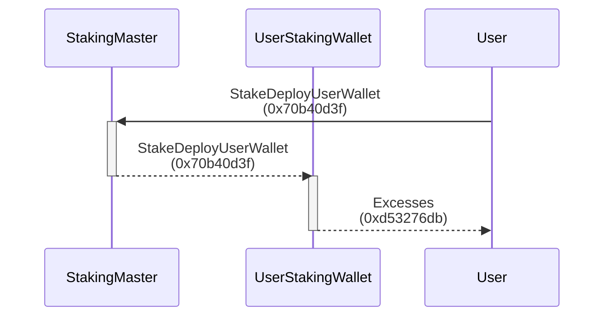
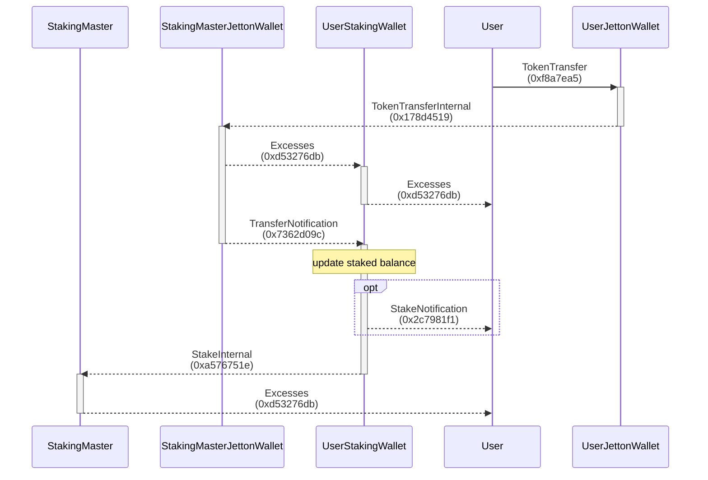
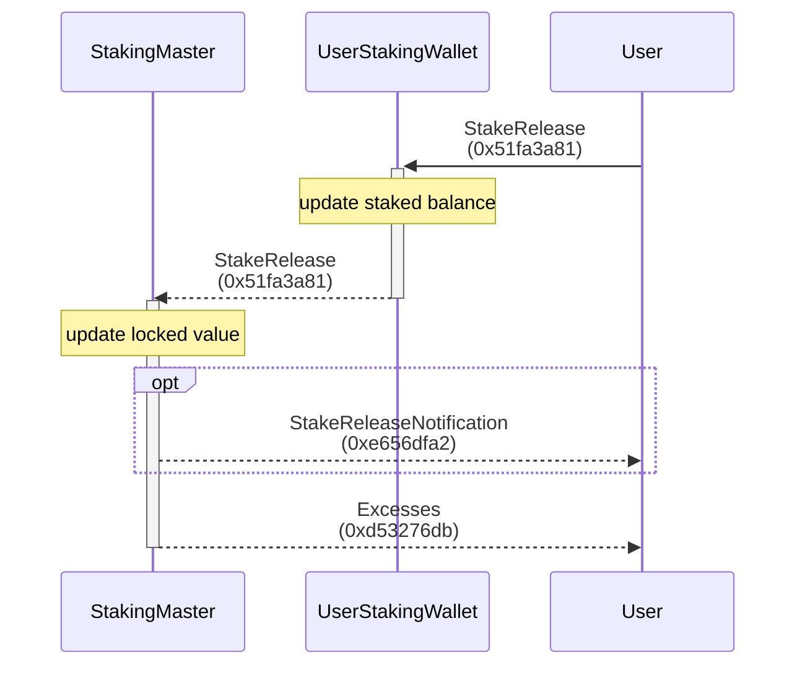
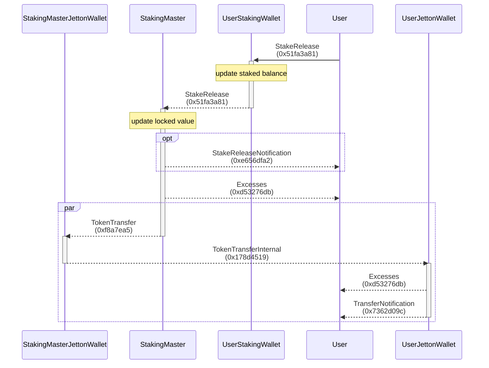

Jetton staking for TON protocol.

## Design

### Stake TON coins

> 
>
> <https://testnet.tonviewer.com/transaction/b09b6b73a8fb72471e8c792719c831c2376086a3f9a091d0424f3cf780065504>

### Stake Jettons and TON coins

#### Deploy User's Stake Wallet First

Should deploy user's stake wallet before staking jettons.

> 
>
> <https://testnet.tonviewer.com/transaction/f64318117ddbb69bfdb079d30a2ba311139fc5a7aadacbb0169d0f3d64f617c5>

#### Stake Jettons

Please make sure the user's stake wallet is deployed before staking jettons.

> 
>
> <https://testnet.tonviewer.com/transaction/fefe263284399ce78434b06c14c6d7bcd6fea8f4be73da235fc4450deb51e56d>

### Release

> 
>
> <https://testnet.tonviewer.com/transaction/8f7d63c31bccef3e05f3f77a74ccc931df24d8b79d24b7015e043f796d4cfd6e>

#### Release TON coins

#### Release Jettons

