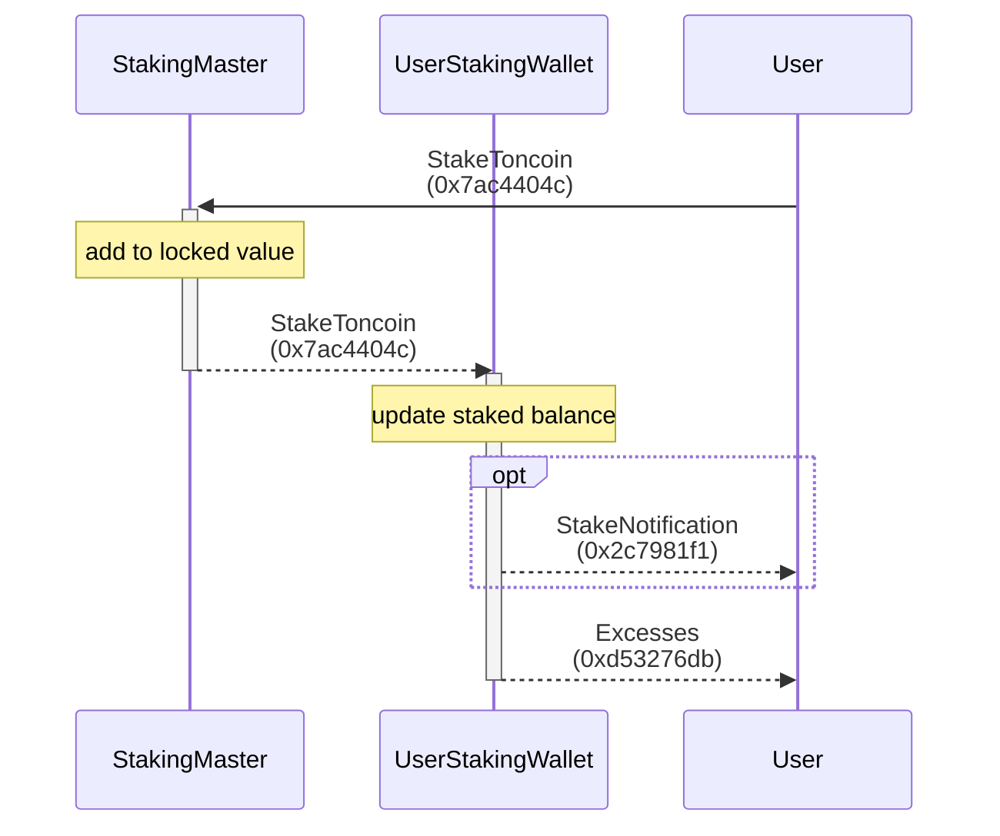
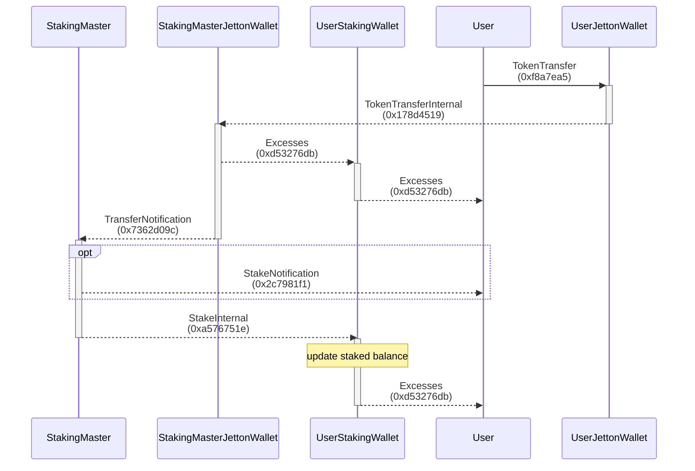
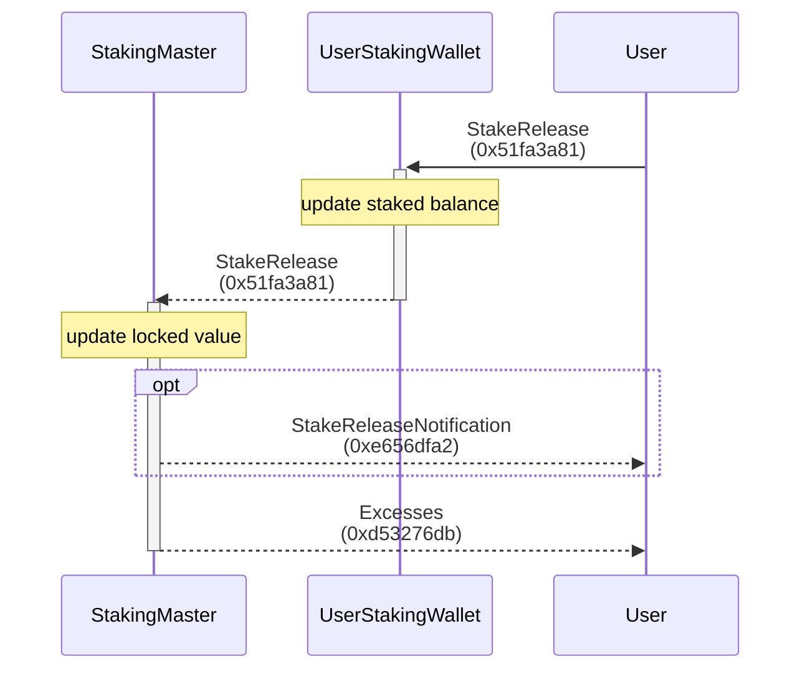
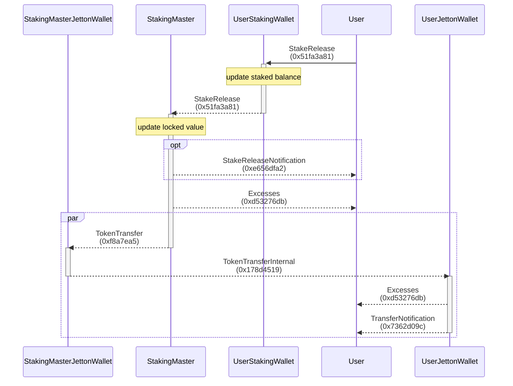

# Staking Contract Template for TON Tact

- [Staking Contract Template for TON Tact](#staking-contract-template-for-ton-tact)
  - [Scripts](#scripts)
  - [Flows](#flows)
    - [Stake TON coins](#stake-ton-coins)
    - [Stake Jettons and TON coins](#stake-jettons-and-ton-coins)
      - [Stake Jettons](#stake-jettons)
    - [Release](#release)
      - [Release TON coins](#release-ton-coins)
      - [Release Jettons](#release-jettons)

Users can stake TON coins along with any Jettons. The primary entity is the Staking Master Contract, and each user will have their individual Staking Wallet Contract. Users have the flexibility to stake and redeem their assets at any time.

**This is an experimental contract template! 🚀 PRs are welcome! 💻✨**

## Scripts

- [../scripts/staking.ts](https://github.com/Laisky/tact-utils/blob/main/scripts/staking.ts)
- [../tests/Staking.spec.ts](https://github.com/Laisky/tact-utils/blob/main/tests/Staking.spec.ts)

## Flows

### Stake TON coins

> 
>
> <https://testnet.tonviewer.com/transaction/b09b6b73a8fb72471e8c792719c831c2376086a3f9a091d0424f3cf780065504>

### Stake Jettons and TON coins

#### Stake Jettons

> 
>
> <https://testnet.tonviewer.com/transaction/8b84cb6025fae09e9c24b9044e716fc7da2715eb261856192162dea2705a2eea>

### Release

> 
>
> <https://testnet.tonviewer.com/transaction/8f7d63c31bccef3e05f3f77a74ccc931df24d8b79d24b7015e043f796d4cfd6e>

#### Release TON coins

#### Release Jettons

